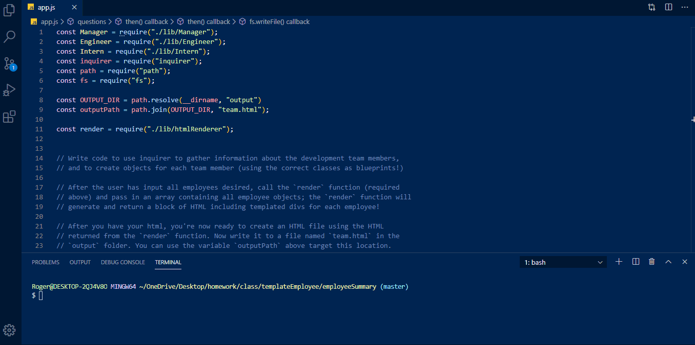

# employeeSummary

## Description
* This app allows users to create a team roster.

## Installation
* To install the required packages for this application, run the following code: 
`npm install`

## Usage
* To use this application: 

1. Clone this repo
2. Install packages
3. Enter `node app` in the terminal, than answer the following questions to build your roster.

 

## Technologies
* Node.js, Inquirer, Jest

## Contributors
@rogerson253

## Contact

#### Rogerson Jean-Charles (@rogerson253)
* Email: [rogerson253@gmail.com](rogerson253@gmail.com)
* LinkedIn: https://www.linkedin.com/in/rogerson-jean-charles253/

## License
MIT